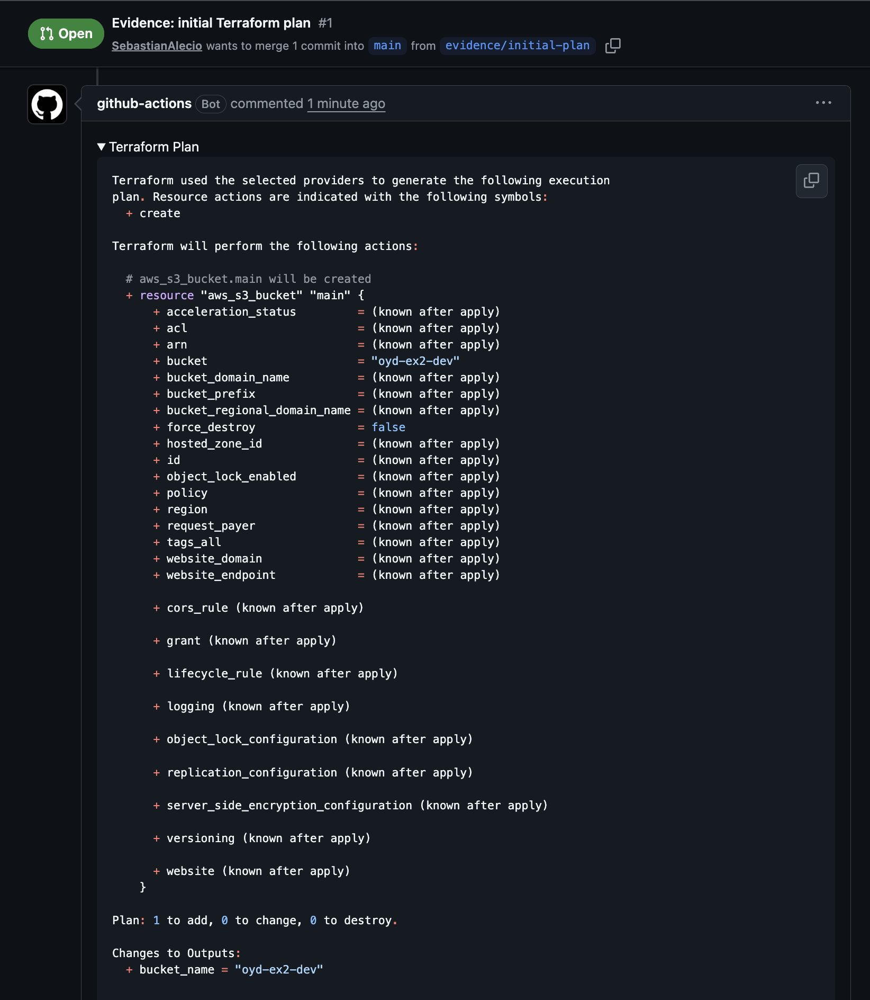

# oyd-exercise-2-2

Ejercicio 2.2 — GitHub Actions CI Workflow for Terraform (Optimizaciones y Desempeño, Sesión 2).

El pipeline valida cada pull request contra `main` con `terraform fmt → init → validate → plan` y publica el plan completo como comentario colapsable en el PR.

## Estructura del repositorio

```
.
├── .github/workflows/terraform-ci.yml   # pipeline de CI
├── envs/dev/dev.tfvars                  # variables del environment dev
├── evidence/                            # capturas para la entrega
├── main.tf                              # recurso aws_s3_bucket
├── outputs.tf                           # output bucket_name
├── provider.tf                          # provider AWS y required_version
└── variables.tf                         # region, environment, bucket_name_prefix
```

## Cómo funciona el pipeline

El workflow `Terraform CI` se dispara únicamente en pull requests apuntando a `main` y ejecuta los siguientes pasos en orden:

1. **Checkout** del código del PR.
2. **Setup Terraform** (`hashicorp/setup-terraform@v3`).
3. **`terraform fmt --check -recursive`** — falla el job si hay archivos mal formateados.
4. **`terraform init -backend=false`** — instala el provider AWS sin configurar backend.
5. **`terraform validate`** — valida la sintaxis y referencias del workspace.
6. **Configure AWS credentials** (`aws-actions/configure-aws-credentials@v4`) leyendo los secrets del repo.
7. **`terraform plan -var-file=envs/dev/dev.tfvars`** — genera el plan y lo captura en `plan.txt` con `tee`.
8. **Post plan as PR comment** — usa `actions/github-script@v7` para postear el plan dentro de un `<details>` colapsable. Este step puede fallar sin bloquear el merge.

Las credenciales AWS (`AWS_ACCESS_KEY_ID`, `AWS_SECRET_ACCESS_KEY`, `AWS_REGION`) se inyectan exclusivamente desde repository secrets — no hay valores hardcoded en el YAML ni en los `.tf`.

## Evidence

- Pull request: <https://github.com/SebastianAlecio/oyd-exercise-2-2/pull/N>


